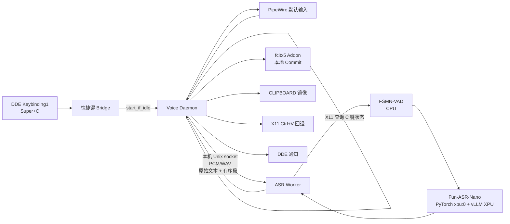
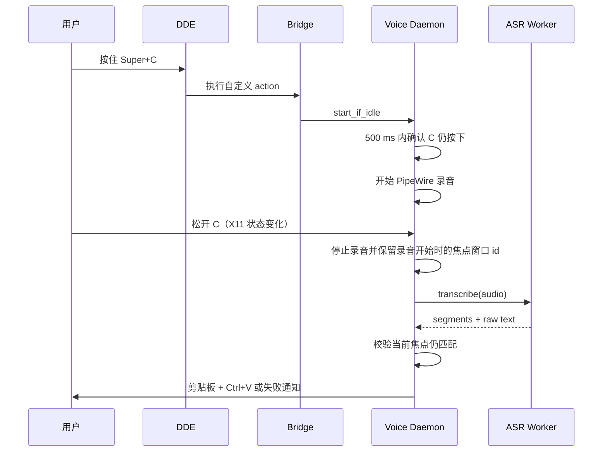

# Fun Voice Ryan 本地语音输入助手技术方案

> **已替代（2026-09-01）：** 本文中的 DDE/bridge 快捷键 POC 未满足按住时序；当前
> 快捷键设计见 [X11 全局热键替换设计](2026-09-01-x11-hotkey-replacement-design.md)。

## 目标

在当前 Deepin X11 桌面上提供一个本地语音输入助手：用户按住 `Super+C` 说普通话，松开后由 FunASR 的 Fun-ASR-Nano 转写，并把**未作术语纠正或格式化的模型原始文本**自动提交到录音开始时的焦点窗口。

首版以识别准确性为先，不提供唤醒词、持续监听、语音命令、跨设备同步或历史记录。

## 已确认的约束与决策

| 项目 | 决策 |
| --- | --- |
| 使用场景 | 按住快捷键说话；松开后转写并输入当前光标位置 |
| 桌面环境 | 当前机器的 Deepin X11；Wayland 不在首版范围 |
| 快捷键 | DDE 全局自定义快捷键 `Super+C` |
| 冲突检查 | 已通过 DDE `LookupConflictShortcut("<Super>C")` 验证无当前系统冲突 |
| 文本 | 普通话为主，允许英文、代码和计算机术语；原样保留模型输出 |
| 延迟目标 | 准确优先；不提供流式部分结果 |
| 音频/文本历史 | 不保留；任务结束即清理 |
| 超长录音 | 允许临时分片；默认 30 分钟硬上限，25 分钟提示 |
| 失败行为 | 仅 DDE 通知，不注入半成品 |
| 剪贴板 | 成功注入后保留识别结果在系统剪贴板 |
| 推理后端 | FunASR Fun-ASR-Nano + vLLM Intel XPU；未通过 XPU POC 时不得静默退回 CPU 解码 |

## 架构不变量

- DDE 只负责发现、冲突管理和触发全局快捷键；录音生命周期由本应用控制。
- 音频编码器/适配器和 LLM 解码均必须实际运行在 `xpu:0`；FSMN-VAD 例外，固定在 CPU。
- 用户语音和转写不得写入日志、历史数据库或模型缓存目录。
- 只有录音开始时的焦点窗口仍然是当前焦点窗口时，才允许自动粘贴。
- 任何异常路径都必须清理本任务的内存、临时音频和待注入文本。
- 单用户单任务：`Transcribing` 时拒绝新录音，不能并发混合两段语音。

## 组件与边界



| 组件 | 责任 | 不负责 |
| --- | --- | --- |
| 快捷键 Bridge | 被 DDE 执行；向 daemon 发送一个本地 `start_if_idle` 消息后退出 | 录音、模型加载、按键轮询 |
| Voice Daemon | 状态机、X11 按住/松开检测、PipeWire 捕获、焦点校验、通知、fcitx/剪贴板上屏和清理 | 模型推理 |
| ASR Worker | 保存已验证的模型、VAD、分段、XPU 推理、按时间组装结果 | 全局快捷键、桌面文本注入 |
| fcitx5 Addon | 在当前输入法输入上下文提交 UTF-8 文本，暴露受限本地 IPC | 录音、模型推理、文本持久化 |
| 模型缓存 | 持久化 Fun-ASR-Nano、VAD 和 Nano 提取出的 vLLM 权重 | 存储任何用户音频或文本 |

Daemon 与 Worker 均运行在当前用户的会话范围内。Worker 仅监听 `${XDG_RUNTIME_DIR}/fun-voice-ryan/asr.sock`，不开放 TCP 端口。

## 快捷键与按住说话协议

### DDE 注册

安装或首次启动时调用 DDE 会话总线服务 `org.deepin.dde.Keybinding1`：

1. `LookupConflictShortcut("<Super>C")`。
2. 无冲突时调用 `AddCustomShortcut(name, action, hotkey)`。
3. `name` 为 `Fun Voice Ryan — 按住说话`，`action` 指向快捷键 Bridge，`hotkey` 为 `<Super>C`。
4. 保存 DDE 返回的 shortcut id，用于后续 `ModifyCustomShortcut` 和卸载时的 `DeleteCustomShortcut`。

快捷键可在 DDE 控制中心显示和修改。每次启动都重新检查已保存 id 与热键冲突；用户把热键改为冲突键时，只通知并禁用本次录音，不替换其他系统快捷键。

### 为什么需要 Bridge 与 X11 轮询

`Keybinding1` 的自定义快捷键 API 触发的是一个 action，不提供可靠的按下/松开事件。因此 Bridge 只负责唤醒 daemon；daemon 使用 X11 的键盘状态查询判断物理 `C` 是否仍被按住：



- 每 10 ms 查询键状态；检测到连续 25 ms 的松开状态即停止。
- 触发后 500 ms 内未确认 `C` 仍按下，视为短按/触发延迟，取消本次操作。
- POC 必须证明 DDE action 在按住阶段被调用，且 `Super+C` 不会向目标应用误输入 `c`。
- 若 POC 证明 DDE 触发发生在松键之后，首版回退为纯 X11 全局抓键实现；不改为“按一下开始、再按一下停止”。这是一项显式的上线门。

## 状态机

```text
Idle
  -> Recording       DDE 请求有效且 C 仍按下
  -> Idle            触发无效/冲突/会话不是 X11

Recording
  -> Transcribing    C 松开、达到 30 分钟或录音设备结束
  -> Idle            用户取消或捕获失败（清理）

Transcribing
  -> Injecting       Worker 返回非空文本
  -> Idle            空结果、Worker/XPU/VAD 失败（清理并通知）

Injecting
  -> Idle            粘贴完成或焦点已变（仅复制并通知）
```

`Recording` 与 `Transcribing` 均拒绝另一个 `start_if_idle`。所有状态转移进入 `Idle` 前执行同一清理函数，保证没有悬挂的捕获进程、套接字请求或临时分片。

## 音频采集与临时数据

当前默认输入为 PipeWire 的 `Digital Microphone`，设备提供 48 kHz、4 通道数据。采集层必须：

1. 读取当前 PipeWire 默认 source，用户可以在配置中选择 source。
2. 在采集时下混并重采样为 16 kHz、单声道、s16le PCM。
3. 以 60 秒的时间戳分片保留连续 PCM 流。该格式约为 1.9 MB/分钟。
4. 前 10 分钟留在内存；超出后将后续分片写到 `${XDG_RUNTIME_DIR}/fun-voice-ryan/`，目录模式为 `0700`。

本机的 `${XDG_RUNTIME_DIR}` 是用户专属 tmpfs，因此临时分片不会进入持久磁盘。文件以模式 `0600` 创建，任务完成、取消、失败和 daemon 启动恢复时都删除。临时目录不用于模型缓存。

PipeWire 录音由 `pw-record` 执行。停止录音时 daemon 发送 `SIGINT` 并有界等待；`0`、`-SIGINT` 和 `130` 都是预期停止状态。录音是否有效只由最小录音时长和实际 PCM/WAV 大小判断，不能因为 `pw-record` 的预期非零退出码而错误丢弃一段可转写音频。

25 分钟显示一次“即将达到录音上限”通知；30 分钟自动停止并转写已经收集的内容。没有以文本重叠去重的后处理：Worker 以连续的 VAD 状态读取分片，生成不重叠的语音段，再按开始时间拼接模型的原始输出。

## 推理后端

### 选型

选择 FunASR 的官方 `FunAudioLLM/Fun-ASR-Nano-2512` checkpoint 和 `FunASRNanoVLLM` 路径：

```text
连续 16 kHz 音频
  -> FSMN-VAD（CPU，max_single_segment_time=30 s）
  -> Nano 音频前端 / Encoder / Adaptor（PyTorch xpu:0，BF16）
  -> Qwen3-0.6B 解码（vLLM Intel XPU，BF16）
  -> 带时间范围的段和拼接文本
```

FunASR 当前 Nano vLLM 实现将音频编码器、适配器和嵌入层移动至传入的 `device`，所以 `xpu:0` 是可验证的候选设备；vLLM 则负责 LLM 解码。上游文档的 Nano 示例主要以 CUDA 验证，因此 Intel Arc 组合是**待本机验收的兼容路径**，并非无条件承诺。

不选 OpenVINO 作为 Nano 的首版后端：它对 Intel GPU 很合适，但其官方语音流水线主要验证 Whisper 等模型，不能满足必须使用 Fun-ASR-Nano 的约束。直接 PyTorch XPU 可作为开发诊断路径，不作为性能和显存管理的首选。

### XPU 环境与锁定策略

- 使用独立 Python 3.12 `uv` 环境；当前机器恰好为 Python 3.12。
- 安装 vLLM 的 Intel XPU 兼容 wheel、匹配的 PyTorch XPU 和 FunASR；不要混装系统 Torch、CUDA Torch 或独立的版本不匹配 `torchaudio`。
- POC 成功后将 FunASR commit、vLLM wheel 版本/索引、PyTorch XPU、Python、Intel GPU compute runtime 与模型 revision 记入 lockfile 和诊断输出。
- 第一次加载时 FunASR 会将 Nano checkpoint 中的 LLM 权重提取为 `Qwen3-0.6B-vllm`；该派生权重放在应用私有模型缓存目录，允许长期保存。
- 初始参数为 `device="xpu:0"`、`dtype="bf16"`、`tensor_parallel_size=1`、`gpu_memory_utilization=0.35`、`enforce_eager=true`。Arc 为共享内存 GPU，先用保守预算；性能调优必须在 POC 成功后进行。

### 上线 POC（硬门）

以下项目全部通过才允许注册为“可用”：

1. `torch.xpu.is_available()` 为真，并记录 XPU 设备名。
2. vLLM XPU backend 可加载普通 Qwen 0.6B 推理。
3. `FunASRNanoVLLM(..., device="xpu:0")` 可加载官方 checkpoint。
4. 10 秒普通话样本通过 `enable_prompt_embeds` 的完整 Nano 路径，返回非空文本。
5. 60 秒、含英文术语的样本正确完成 VAD 分段与时间顺序拼接。
6. 日志、vLLM 平台信息和 XPU 内存指标证明 LLM 解码和 Nano 音频模块均未回退至 CPU。
7. OOM 时 Worker 报错并保持桌面 daemon 可用；禁止隐式 CPU fallback。

若第 1--6 项有任一失败，工程停在兼容性修复阶段，不开始桌面功能验收。可另开一个明确标记的研究 spike，验证 FunASR Nano 的 llama.cpp/Vulkan 路径是否能在 Intel Arc 上完整满足需求；它不是自动运行时回退，必须重新通过端到端 POC 并由用户明确选择。

## Worker 接口

Worker 通过 Unix Domain Socket 提供最小本地接口：

| 接口 | 输入 | 输出 | 约束 |
| --- | --- | --- | --- |
| `GET /health` | 无 | 依赖锁版本、`xpu_ready`、模型就绪与 GPU 指标 | 不返回用户数据 |
| `POST /transcribe` | PCM/WAV 流、采样率、声道、请求 id | `text`、按时间排序的 `segments`、处理耗时 | 不写请求体或文本日志 |

返回格式中的 `segments` 至少包括 `start_ms`、`end_ms`、`text`。Daemon 使用 `text` 直接注入，不改变大小写、标点、术语或代码样式。

## 文本注入与桌面安全

当前机器已运行 fcitx5，且安装了 Fcitx5Core 开发库。因此上屏采用本地 fcitx5 addon 作为首选，X11 剪贴板粘贴只作为降级通道：

1. 录音开始时记录 X11 focus window id；如果 addon 健康检查通过，同时获取当前输入上下文的不可预测 focus token。
2. 转写完成后再次查询 X11 focus window id；不一致时不发送上屏请求，只把完整原始文本写入剪贴板并通知“焦点已变化，结果已复制”。
3. 一致时，通过 mode `0600` 的 `${XDG_RUNTIME_DIR}/fun-voice-ryan-fcitx.sock` 发送 `COMMIT <focus-token>\n<utf8-text>`。Addon 必须验证 token 仍属于当前聚焦输入上下文后才调用 fcitx5 的 `commitString`。
4. 无论 fcitx5 上屏成功与否，都独立、带超时地将完整文本镜像到 CLIPBOARD selection；剪贴板超时不得撤销或阻塞已经成功的上屏。
5. 仅当 fcitx addon 不可用或拒绝本次请求，且 X11 焦点仍一致时，才使用 CLIPBOARD + XTEST `Ctrl+V` 回退。两个通道均失败时保留可用的剪贴板结果并显示失败通知。

单个 addon 消息最大 64 KiB；超出时 daemon 必须只在 UTF-8 字符边界拆成不超过 8 KiB 的有序 `COMMIT` 块，且每块使用同一 focus token。任何一块被拒绝即停止后续块，不向新的焦点窗口继续写入。

该设计保留中文、英文、换行和代码符号，不依赖逐字模拟键盘事件。首版不尝试恢复原剪贴板，避免破坏其可能包含的图片、富文本或多个 MIME 类型。Addon 和 daemon 的诊断日志严禁记录 `COMMIT` payload 或模型文本。

## 通知、错误与可观测性

使用 DDE 的标准桌面通知，通知内容不回显转写文本：

| 情况 | 通知 |
| --- | --- |
| 开始录音 | `录音中` |
| 松键后 | `识别中` |
| 无声 | `未检测到语音` |
| 焦点变化 | `焦点已变化，结果已复制到剪贴板` |
| 剪贴板镜像失败 | `文本已输入，但剪贴板备份失败` |
| XPU/Worker 失败 | `本地识别失败：<安全的错误类别>` |
| 达到限制 | `已达到 30 分钟录音上限，开始识别` |

可记录的诊断仅包括时间、状态转移、耗时、音频时长、错误类别、依赖版本、设备信息与内存指标；严禁记录音频字节、文件路径中可识别内容或转写文本。

Worker 用 systemd user service 的 `Restart=on-failure` 运行。Daemon 遇到 Worker 断开会显示失败，不自动把待转写音频重新提交到其他后端。

所有外部边界使用可替换的适配器：`DdeKeybindingClient`、`X11FocusGuard`、`PipeWireRecorder`、`FcitxCommitClient`、`ClipboardMirror` 和 `AsrWorkerClient`。业务状态机只依赖这些小接口，测试使用 fake 实现，不需要真实桌面、声卡或 GPU。

## 进程启动与配置

安装物包含：

- DDE autostart `.desktop`：将 `DISPLAY`、`XAUTHORITY`、`DBUS_SESSION_BUS_ADDRESS` 等会话变量导入 user systemd，然后启动 daemon。
- `fun-voice-ryan-daemon.service`：会话级、单实例、随图形会话退出。
- `fun-voice-ryan-asr.service`：由 daemon 首次请求时启动，模型加载成功后保留到注销。
- `fun-voice-ryan-hotkey`：DDE action 调用的轻量 Bridge。
- `fun-voice-ryan-fcitx` addon：用户级 fcitx5 插件，加载后拥有受限的本地 commit socket；addon 不可用不阻塞 daemon 启动。

配置建议使用单一 TOML 文件：

```toml
[shortcut]
hotkey = "<Super>C"

[audio]
source = "default"
memory_threshold_minutes = 10
max_recording_minutes = 30

[input_method]
primary = "fcitx5"
commit_timeout_ms = 500
allow_x11_paste_fallback = true

[inference]
model = "FunAudioLLM/Fun-ASR-Nano-2512"
device = "xpu:0"
dtype = "bf16"
gpu_memory_utilization = 0.35
enforce_eager = true
keep_warm_until_logout = true

[privacy]
retain_history = false
```

配置中的模型缓存路径和 socket 路径由应用计算，不接受任意世界可写目录。系统级快捷键改动仅操作由本应用保存 id 的自定义快捷键。

`fun-voice-ryan --self-test` 是安装与升级的放行检查，按只读或可清理的方式验证：DDE/X11 会话、`Super+C` 冲突、Bridge 到 daemon 的按住时机、PipeWire 默认输入和最短捕获、fcitx addon `PING`、剪贴板/XTEST 回退能力、Worker 健康检查，以及完整 XPU POC。未通过项必须给出可操作的错误类别，不能加载模型后才发现桌面集成无法工作。

## 验收测试

### 单元测试

- 状态机拒绝并发、正确处理取消、超时和 Worker 失败。
- PCM 分片在 10 分钟阈值前后保持单调时间戳，无丢帧或重叠。
- 清理函数在成功、VAD 空结果、XPU OOM、进程取消和异常退出恢复时均被调用。
- 焦点守卫与剪贴板决策：相同窗口粘贴；变化窗口只复制。
- fcitx focus token 一致时只提交一次；token 不一致、无输入上下文或 addon 超时均不提交，并可在焦点仍一致时走 X11 回退。
- 剪贴板写入超时或失败不能阻塞 fcitx 提交；所有日志断言不得包含转写文本。
- `pw-record` 收到 `SIGINT` 后的预期退出状态不会把有效音频误判为失败。
- Worker 的段排序和原始文本拼接不做术语替换。

### 集成测试

- DDE 中可看见、修改、删除本快捷键；`Super+C` 无系统冲突。
- 在浏览器、终端和 IDE 按住/松开，验证不误输入字母 `c`。
- fcitx addon `PING` 与 `COMMIT` 在中文、英文、换行及代码符号上正确工作；失去焦点后 token 被拒绝。
- 合成短音频、普通话夹英文术语、中等时长和超过内存阈值的录音均生成正确顺序的结果。
- 录音中切换焦点、锁屏、拔掉输入设备、杀死 Worker、制造 XPU OOM 时无错误注入和无残留文件。
- 连续 30 次录音验证不产生重复文本、任务串台或守护进程泄漏。

### 人工质量验收

建立一组个人常用的普通话/英文术语语料，覆盖产品名、命令行、文件名、API、版本号和中英文夹杂。以模型原始输出保存为基准，只衡量识别质量，不在应用层“纠正”结果以掩盖模型问题。

## 非目标与已知边界

- 不支持 Wayland、Windows、macOS 或多用户系统服务。
- 不提供实时字幕、唤醒词、说话人分离、语音命令或历史检索。
- 不保证能识别浏览器内部的密码输入框；焦点守卫只保证不会因窗口切换向另一窗口注入。使用敏感输入框前应避免触发快捷键。
- 不读取 `/dev/input/event*`；这避免了 raw keyboard 监听所需的额外权限。DDE action 在按住阶段不可用时，才将纯 X11 抓键作为有单独审查的回退方案。
- XPU 组合的最大技术风险是 FunASR 的 `enable_prompt_embeds` 与 vLLM XPU kernel 的端到端兼容性；POC 是该风险的唯一放行依据。

## 参考实现中吸收与拒绝的设计

`qwen-voice-input-deploy` 提供了有价值的同类桌面实践：`pw-record` 的结束语义、fcitx5 addon 的本地 IPC、上屏与剪贴板解耦、systemd user service、自检命令和可替换边界的单元测试。上述模式已吸收，但实现不得复制其会记录文本、持久化录音、直接读取 `/dev/input/event*`、自动 LLM 润色或实时增量上屏的行为；这些都与本方案的隐私、安全或“原始最终文本”约束冲突。

## 参考

- FunASR 项目与 Fun-ASR-Nano 使用说明：<https://github.com/modelscope/FunASR>
- FunASR Nano vLLM 实现：<https://github.com/modelscope/FunASR/blob/main/funasr/models/fun_asr_nano/inference_vllm.py>
- FunASR vLLM 指南：<https://github.com/modelscope/FunASR/blob/main/docs/vllm_guide.md>
- vLLM Intel XPU 安装与硬件要求：<https://docs.vllm.ai/en/latest/getting_started/installation/gpu/>
