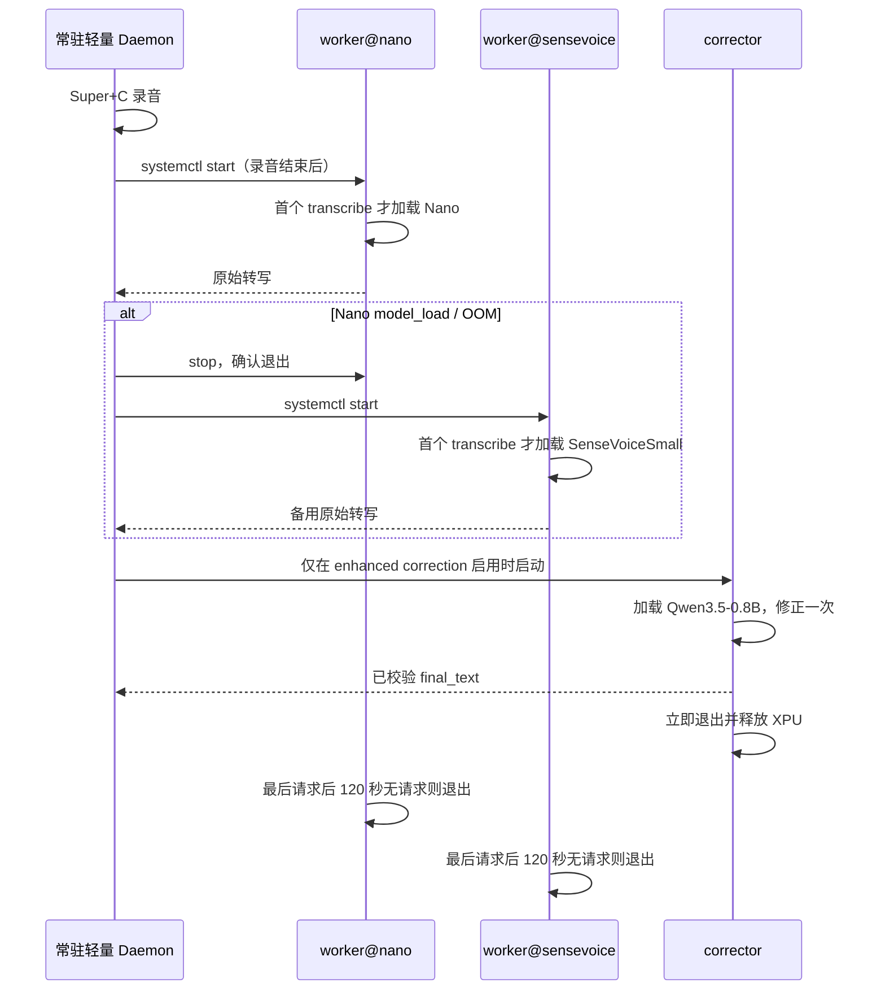

# Fun Voice Ryan 按需模型生命周期与低 KV Cache 设计

## 已确认决策

| 项目 | 决策 |
| --- | --- |
| 修正模型 | 固定 `Qwen/Qwen3.5-0.8B`；不安装或回退到其他 Qwen 模型 |
| 默认 ASR | `FunAudioLLM/Fun-ASR-Nano-2512`，准确优先 |
| Nano 配置 | `xpu:0`、BF16、`gpu_memory_utilization=0.15`、`max_model_len=1536` |
| 低内存备用 | `iic/SenseVoiceSmall`，仅当 Nano 无法加载或发生 XPU OOM 时使用 |
| 生命周期 | 模型不随登录加载；ASR worker 空闲 120 秒后退出，Qwen 一次修正完成后立即退出 |
| CPU 回退 | 禁止；XPU 不可用或模型不能在 XPU 加载时返回错误 |

## 根因和目标

旧 worker 在 systemd 登录时启动，并在监听 socket 前加载 Nano。其
`gpu_memory_utilization=0.35`、`max_model_len=4096` 使 vLLM 在本机预留约
8.1 GiB KV Cache；加上模型和运行时，worker cgroup 常驻 15.5 GiB、峰值 16.9 GiB。

目标是登录后不加载任何神经网络，录音结束后才开始 ASR；连续使用仍可复用模型，停止
使用后自动释放进程及 XPU 资源。准确率优先的默认路径不变。

## 进程和请求流



`fun-voice-daemon.service` 仍可在图形会话登录时启动，它只持有 X11、PipeWire、
Fcitx 与 Unix socket，不加载模型。取消它的自启会同时失去全局快捷键；因此被取消的
是所有模型服务的开机自启，而不是 daemon。

## Worker 单元和回退边界

使用一个不可 enable 的模板单元 `fun-voice-worker@.service`，实例为 `nano` 和
`sensevoice`。两个实例各有私有 socket，且 `Restart=no`；安装脚本显式禁用并停止旧的
`fun-voice-worker.service`，不再 enable 任一模型 worker。

Worker 启动时先绑定 socket，`health` 能报告 `model_ready=false`；只有第一个
`transcribe` 才构造模型。Daemon 在启动实例后按条件轮询 socket，而不是立即重试一次。
如此模型加载错误能以 `worker.model_load` 回到请求端，而不是被误报为 socket 不可达。

只在下列 Nano 错误后尝试 SenseVoiceSmall：

- `worker.model_load`：Nano XPU 加载失败；
- `worker.oom`：Nano 推理 XPU 内存不足。

Daemon 会先停止 Nano 实例并等待它退出，再启动 SenseVoiceSmall，避免两组模型的 XPU
分配重叠。空语音、超时、设备错误、协议错误和普通识别结果绝不触发降级。备用结果带
非敏感 `engine="sensevoice"` 元数据供结构化接口读取，但不会在通知或日志中输出文本。

## Qwen 修正器

Corrector 继续遵守已有的 text-only、BF16、`xpu:0`、非思考和输出校验约束。它不随
daemon 或 worker 启动；收到一次经过结构化校验的修正请求时创建独立进程，响应完成后
进程退出。Nano/SenseVoice 与 Qwen 不会常驻重叠。若 Qwen 加载、超时、OOM 或输出校验
失败，使用 raw text 作为 final text；这不是切换到其他模型或 CPU。

## 配置和可观测性

`[inference]` 的安全默认值为：

```toml
gpu_memory_utilization = 0.15
max_model_len = 1536
idle_unload_seconds = 120
allow_sensevoice_fallback = true
```

允许的范围为 `0.10..0.20`、`1024..1536` 与 `30..300` 秒。设置超出范围会在服务启动
前拒绝，防止配置再次创建大 KV Cache。Qwen 的模型标识仍固定为
`Qwen/Qwen3.5-0.8B`；它的 on-demand 生命周期不开放为其他模型选择。

健康接口只返回 profile、`model_ready`、`active_requests` 和距空闲卸载的秒数。日志只记录
模型 profile、状态、耗时和错误码，不记录音频路径或文本。验收需实测：登录后没有
`fun-voice-worker@*` 或 corrector 进程；Nano 空闲卸载后 cgroup 消失；Nano 低 KV 配置在
短、长音频 POC 均能 XPU 推理；构造 Nano model_load/oom 时，SenseVoiceSmall 才被调用。

## 非目标

- 不依据低置信度、语言、标点或文本内容自动切换到 SenseVoiceSmall。
- 不让两个 ASR 模型或 ASR 与 Qwen 为了“预热”而常驻。
- 不降低 30 分钟录音、内存中切分、焦点守卫、Fcitx 或结构化结果的隐私边界。
