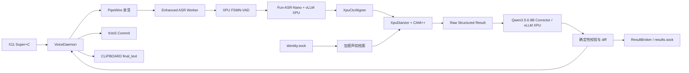

# Fun Voice Ryan 结构化转写、持久声纹身份与 XPU 文本修正设计

## 1. 目标与已确认决策

在不改变现有 **Deepin X11 + 按住 `Super+C` + 焦点守卫** 行为的前提下，把一次录音扩展为可由本地程序读取的结构化转写结果，并将受控修正后的文本自动上屏并写入剪贴板。

| 项目 | 决策 |
| --- | --- |
| 主 ASR | 保留已验证的 `FunAudioLLM/Fun-ASR-Nano-2512` + vLLM XPU |
| 修正模型 | `Qwen/Qwen3.5-0.8B`，使用 text-only、非思考模式 |
| 上屏与剪贴板 | 仅写入通过校验的 `final_text`；默认是修正文本，修正不可用时才为原始文本 |
| 原始转写 | 只在本次结构化结果的内存副本与受限本地接口中可见；不写剪贴板、日志或历史 |
| 结构化结果 | 仅通过本地 Unix Socket API 返回；最多保留最近 8 条、TTL 10 分钟 |
| 说话人身份 | 只识别用户明确登记的本地声纹档案；不自动建档、不跨设备同步、不上传 |
| 声纹存储 | 只持久化 AES-256-GCM 加密的声纹统计量和加密显示名；不保存原始录音 |
| GPU 要求 | 所有神经网络和声学/说话人/文本模型计算均须在 `xpu:0`；CPU 只处理录音 I/O、IPC、加密和 JSON |
| CPU 回退 | 禁止。任一模型或关键张量不在 XPU 时增强模式报错，不改走 CPU |

这里的“GPU”是 Intel Arc 的 XPU。复制少量最终标量到主机以序列化 JSON 不构成 CPU 推理；任何张量对齐、说话人特征、聚类、相似度计算或 LLM 解码都不得转到 CPU。

## 2. 设计边界与上游差异

FunASR 的官方 Nano 示例可返回每句的说话人编号、起止时间与文本，Nano 的 vLLM 路径也可产生字符级时间戳。首版不直接采用其一体化 `AutoModel(model=..., spk_model="cam++")` 链路，原因是当前上游实现的 CTC 强制对齐显式调用 `.cpu()`，而 CAM++ 聚类使用 NumPy、SciPy 和 scikit-learn；这违反本项目的 XPU-only 约束。

本设计复用 FunASR 的模型、前端、输出语义和已验证的 Nano vLLM 加载方式，但在本项目中实现以下三个设备受控适配器：

1. `XpuCtcAligner`：在 XPU 上计算 CTC forced alignment，替代上游 CPU 对齐器。
2. `XpuDiarizer`：CAM++ 特征提取、录音内聚类及已登记身份匹配均在 XPU 张量上完成，替代上游 CPU 聚类器。
3. `CorrectionClient`：连接独立的 Qwen3.5 XPU 服务，执行受控整段修正和确定性输出校验。

不从 Nano 模型缓存中抽取的 `Qwen3-0.6B/` 子目录加载纠正器。该目录只包含 Nano 解码所需的配置和 tokenizer，不是独立的通用文本模型。

## 3. 总体架构



### 3.1 进程边界

| 进程 | 责任 | 模型/数据 |
| --- | --- | --- |
| `fun-voice-daemon` | X11 热键、录音、焦点确认、Fcitx、剪贴板、结果缓存与 API 授权 | 不加载模型，不记录文本 |
| `fun-voice-worker` | XPU VAD、Nano、时间戳、CAM++、说话人聚类与身份匹配 | 只处理任务临时音频和中间结果 |
| `fun-voice-corrector` | 预热 `Qwen/Qwen3.5-0.8B`，执行受控整段文本修正 | 只接收本次原始结构化文本 |
| `fun-voice-result` CLI | 读取 `results.sock`，将 JSON 输出到调用者 stdout | 不缓存、不转发 |
| `fun-voice-identity` CLI | 显式注册、列举、重命名、删除已登记身份 | 不可读取或导出声纹向量 |

Corrector 作为独立用户级服务而不是嵌入 ASR Worker：Qwen3.5 的模型加载、vLLM 错误和 OOM 不会破坏已验证的 Nano Worker；两个服务仍使用同一 XPU 运行时和同一张 `xpu:0`。每个 vLLM 引擎各自拥有权重与 KV Cache，不能也不尝试共享模型实例。

### 3.2 调度与内存

同一用户只允许一个增强转写任务。Worker 内的 VAD、Nano、对齐和 CAM++ 按顺序执行；Corrector 仅在原始结构化结果完成后执行。Daemon 对 Corrector 设置请求超时，Corrector 内部串行化 `generate()`。

Nano 与 Qwen3.5 均使用独立、保守的 XPU 内存预算：
`gpu_memory_utilization=0.15`、`max_model_len=1536`。它们绝不常驻重叠；Qwen
只在一次修正请求的独立子进程中加载，响应后退出。Qwen3.5 必须使用
`language_model_only`/text-only 配置，避免加载对文本修正无用的视觉分支。

## 4. 原始结构化结果契约

Worker 内部使用不可变 typed dataclass；跨 Socket 只传 UTF-8 JSON。所有时间均为原录音起点的整数毫秒。`raw_*` 字段永远描述 Nano 原始输出，修正模型不得改变这些字段。

```json
{
  "schema_version": 1,
  "result_id": "b69b63bf2d424dcca0e097d1270bbb92",
  "created_monotonic_ms": 123456,
  "duration_ms": 8760,
  "raw_text": "今天下午三点执行get commit，然后运行py test。",
  "final_text": "今天下午三点执行git commit，然后运行pytest。",
  "correction": {
    "model": "Qwen/Qwen3.5-0.8B",
    "status": "accepted",
    "edits": [
      {"unit_id": "u1", "kind": "term", "before": "get", "after": "git"},
      {"unit_id": "u1", "kind": "spacing", "before": "py test", "after": "pytest"}
    ]
  },
  "speakers": [
    {"local_id": "speaker_0", "profile_id": "spk_...", "display_name": "Ryan", "match": "accepted"},
    {"local_id": "speaker_1", "profile_id": null, "display_name": null, "match": "unknown"}
  ],
  "units": [
    {
      "id": "u1",
      "start_ms": 420,
      "end_ms": 4260,
      "speaker": "speaker_0",
      "raw_text": "今天下午三点执行get commit，",
      "corrected_text": "今天下午三点执行git commit，",
      "tokens": [
        {"text": "今", "start_ms": 420, "end_ms": 500, "confidence": 0.98}
      ]
    }
  ],
  "timing_status": "available",
  "identity_status": "available"
}
```

`units` 是按原始时间排序的“说话人连续发言单元”；每个单元可包含多个按原始标点切出的句子。它是时间、说话人和纠正文本的唯一关联边界，绝不因 LLM 输出而重新排序、合并或拆分。

纠正文本没有逐字符对齐时间戳：时间戳仅对 `raw_text` 的 `tokens` 有效。`corrected_text` 继承所属单元的起止范围，避免把 LLM 新生成或替换的字符伪装成声学测量结果。

## 5. `results.sock` 接口与内存保留

Daemon 在 `${XDG_RUNTIME_DIR}/fun-voice-ryan/results.sock` 监听，父目录模式 `0700`、Socket 模式 `0600`。每次连接使用 `SO_PEERCRED` 验证调用者 uid 与服务 uid 相同；没有 TCP、D-Bus 广播或文件导出接口。

| 请求 | 响应 | 语义 |
| --- | --- | --- |
| `{"op":"result.latest"}` | 最新一条完整结构化结果 | 无结果时 `result.not_found` |
| `{"op":"result.get","result_id":"..."}` | 指定完整结构化结果 | id 必须是本进程生成的 128-bit 随机值 |
| `{"op":"result.list"}` | 不含文本的 id、创建时间和状态 | 至多最近 8 条 |

结果保存在 daemon 私有有界内存 `OrderedDict` 中；写入时开始 10 分钟 TTL，达到数量上限先删除最旧项。删除时清除容器引用和序列化缓存；Python 不能承诺物理内存覆写，因此文档不能声称“安全擦除”。任何 restart、logout、崩溃或 TTL 到期都使结果不可恢复。

响应沿用 Worker 的 4 MiB 上限；超出时按 `result.too_large` 失败，绝不截断到可能破坏 JSON 或时间顺序的半结构化结果。

## 6. XPU 时间戳

### 6.1 `XpuCtcAligner`

Nano 推理时保留每个 VAD audio window 的 encoder 输出和生成 token 序列。对齐器在 `xpu:0` 执行：

1. CTC decoder 与 `log_softmax` 在 XPU 计算 emission logits。
2. 目标 token、动态规划表、回溯索引都保持 XPU tensor。
3. 仅将最终的 `{token,start,end,score}` 标量列表移到主机 JSON 化。
4. 将局部时间加上**实际 ASR window 的起点**，再裁剪到对应原始 VAD 区域；不把 250 ms ASR overlap 重复计入时间轴。

为防止上游的异常吞没造成“有文本但无时间戳”，对齐失败必须带稳定错误码和 `timing_status="unavailable"`。运行期绝不调用 FunASR 上游 `forced_align()`；POC 与单元测试可使用其 CPU 实现作为离线 golden reference，但不得成为服务依赖。

### 6.2 句与说话人单元

按 token 时间切分句子，优先使用 Nano 原生标点；没有终止标点时仅在说话人切换或 VAD 边界分单元，禁止由纠正模型凭空改变时间边界。每个单元的 `start_ms/end_ms` 是其中首尾有效 raw token 的范围；无 token 时退回原 VAD 范围并标记 `timing_status="approximate"`。

## 7. XPU 说话人分离与持久身份

### 7.1 录音内分离

CAM++ 使用 1.5 秒窗口、0.75 秒步长在 XPU 生成 L2-normalized 说话人向量。随后在 XPU 完成余弦 affinity、簇数选择、聚类与相邻窗口平滑。实现优先使用 XPU 支持的 torch 基元；若谱分解在本机 Arc 不可用，采用同样在 XPU 上运行的阈值凝聚策略，而不是导入 NumPy/scikit-learn CPU 算法。

聚类输出是录音内稳定的 `speaker_0...speaker_n`。以时间交叠最大原则分配给第 6 节的单元。重叠发言不是首版目标：有明显重叠且不能高置信归属时输出 `speaker="unknown_overlap"`，不得强行指定已登记身份。

### 7.2 本地声纹档案

身份只用于用户明确登记的少量说话人，所有数据留在本机。

**注册流程**：

1. `fun-voice-identity enroll --name <显示名>` 在 `identity.sock` 创建待注册会话。
2. Daemon 提示用户完成 3–5 次按住说话；每次有效净语音与质量阈值由 POC 定义。
3. Worker 用 CAM++ XPU 提取并质量筛选向量，计算 profile centroid、离散度和阈值校准数据。
4. 录音工件和单次特征在会话完成即删除；只将加密 profile record 落盘。
5. 注册成功后显示 profile id；没有显式成功确认不创建档案。

**持久化**：数据库位于 `${XDG_DATA_HOME:-~/.local/share}/fun-voice-ryan/speaker-profiles.sqlite3`，文件模式 `0600`、目录 `0700`。数据库只保存 opaque profile id 和 AES-256-GCM 密文（包含声纹统计量、显示名、创建/更新信息）；AAD 绑定 uid、profile id 和 schema version。随机 32-byte 主密钥仅存于当前用户的 Secret Service 条目；密钥不可访问时身份功能锁定，绝不降级保存明文或私自生成替代密钥。

`identity.sock` 同样要求同 uid peer credential，提供 `profile.list`、`profile.rename`、`profile.delete` 和注册控制。它不提供“导出声纹”操作。删除操作要求 profile id 和显式确认标志，删除密文记录后不可恢复。

### 7.3 匹配策略

任务结束时，临时说话人中心与已解密 profile centers 在 XPU 上批量计算余弦相似度。只有同时满足经用户环境标定的：最小有效语音时长、绝对相似度阈值、第一/第二候选 margin 与 profile 离散度阈值时，才返回 `match="accepted"` 和显示名；否则保持 `unknown`。禁止把低置信未知说话人自动合并进任何档案。

数值阈值不是常量：必须用已登记说话人及非目标说话人的脱敏验证样本校准，并在 profile 版本中保存。准确优先意味着阈值宁严勿松，误认身份比漏认更不可接受。

## 8. Qwen3.5-0.8B 受控文本修正

### 8.1 Corrector 配置

Corrector 固定模型 id 为 `Qwen/Qwen3.5-0.8B`，从 ModelScope 下载到应用私有模型缓存并锁定 revision/hash。它使用 vLLM Intel XPU、BF16、text-only 和非思考模式；不得启用视觉输入、工具调用、长思考、MTP 或互联网访问。

调用输入包含按时间排序的带不可变 unit id 的完整原文、用户维护的术语表和严格系统指令。术语表可包含 `git`、`pytest`、项目名、API 名称等；它是识别提示和修正约束，不是后处理替换规则。

### 8.2 输出协议与校验

为避免依赖未在 Arc XPU 验证的 constrained-JSON 后端，模型输出采用不可变 sentinel envelope：

```text
[[UNIT:u1]]今天下午三点执行git commit，[[/UNIT]]
[[UNIT:u2]]然后运行pytest。[[/UNIT]]
```

Corrector 必须：保留所有 unit id、顺序和数量；只输出该 envelope；不输出解释、Markdown 或新字段。调用侧在 CPU 进行确定性解析和验证：

- 每一个请求 unit id 恰出现一次，顺序不变；
- 不允许空单元、额外单元或无包裹文本；
- 单元原始时间、speaker 和 tokens 不变；
- 编辑密度不得超过经评测确定的上限；
- 代码/术语保护清单中的 token 只能保持不变或替换为清单内的明确候选；
- 计算 deterministic diff，绝不采用模型自报的变更理由。

校验成功：`final_text` 为所有 `corrected_text` 的时间顺序拼接，`correction.status="accepted"`。校验失败、超时、OOM 或 Corrector 不可用：保留完整原始结构化结果，`final_text=raw_text`，`correction.status` 说明稳定错误类别，通知“修正不可用，已输入原始文本”。这不是 CPU fallback。

LLM 不得修改身份、时间戳、单元边界、焦点、剪贴板策略或声纹档案。它只负责文本候选；最终接受权永远在确定性校验器。

## 9. 桌面输出与隐私

Daemon 在焦点仍匹配时，以现有 Fcitx 优先、X11 Ctrl+V 降级机制提交 `final_text`；无论 Fcitx 是否成功，都独立将 `final_text` 写入 CLIPBOARD。焦点变化时不向新窗口输入，但仍写入 `final_text` 到剪贴板并通知“焦点已变化，修正结果已复制”。原始文本与完整 JSON 永远不写剪贴板。

日志、DDE 通知、systemd journal、崩溃诊断、健康检查和 POC 报告不得包含录音、raw text、corrected text、术语表、声纹向量、身份显示名或结果 id。可记录的只有状态、耗时、音频时长、段/说话人数、错误码、模型 revision、设备与 XPU 内存统计。

## 10. 配置、部署与升级

配置扩展为：

```toml
[enhanced]
enabled = true
result_ttl_seconds = 600
result_max_entries = 8

[correction]
model = "Qwen/Qwen3.5-0.8B"
device = "xpu:0"
dtype = "bf16"
gpu_memory_utilization = 0.15
max_model_len = 1536
enable_thinking = false

[speaker_identity]
enabled = true
device = "xpu:0"
```

所有 `device` 字段都只接受 `xpu:0`。模型 id、revision、vLLM XPU wheel、Torch XPU、FunASR、CAM++ revision 和 Intel compute runtime 版本均写入锁定诊断。运行期模型加载只能使用已下载的本地 snapshot；安装或显式模型更新阶段才允许网络下载。

新增用户级 `fun-voice-corrector.service`，在 Worker 之后启动并在注销时停止；它只监听 `${XDG_RUNTIME_DIR}/fun-voice-ryan/corrector.sock`（`0600`）。安装脚本先跑增强 POC，所有硬门通过后才写入或重启增强服务。任何版本更新先在隔离环境验证 Qwen3.5，再更新生产虚拟环境，避免破坏现有 Nano XPU 路径。

## 11. XPU 硬门与验收

增强安装的放行条件是在既有九项 Nano XPU 硬门之外全部通过：

1. FSMN-VAD 参数与关键输入 tensor 位于 `xpu:0`，完成短/长音频分段。
2. Nano encoder、adaptor、prompt embeddings、CTC decoder 与 CTC head 位于 `xpu:0`。
3. `XpuCtcAligner` 对基准音频返回单调 token 时间戳；与离线 CPU golden reference 的误差在预设容差内；运行记录中没有 `.cpu()` 对齐路径。
4. CAM++ 参数、输入和输出 embeddings 位于 `xpu:0`；XPU 聚类及 profile cosine matching 返回预期标签。
5. `Qwen/Qwen3.5-0.8B` 在 text-only、非思考模式加载并完成普通话、英文和代码术语的修正集；参数与 vLLM decoder 为 XPU。
6. Corrector 遵守 sentinel 协议；格式错误、过量改写、超时和 OOM 被拒绝，原文可用且 Worker/Daemon 存活。
7. Nano 与 Corrector 同时常驻时 XPU 峰值不 OOM；杀死 Corrector 或制造其 OOM 不影响下一次 Nano 转写。
8. 系统日志、JSON 诊断和剪贴板检查证明 raw text 不泄漏；只有 `final_text` 出现在 Fcitx/clipboard。
9. 声纹注册后，同一登记人可被保守识别、未登记人输出 `unknown`、错误候选不会自动关联；删除档案后立即不可匹配。

### 自动化测试

- dataclass/JSON 编解码：时间单调性、UTF-8、大响应、未知字段、TTL/LRU 清理。
- XPU adapter：设备断言、拒绝 CPU module/tensor、时间偏移、对齐 failure 不伪造 token。
- Corrector：envelope 解析、id/顺序/编辑率/术语保护、raw fallback 和不含文本的日志断言。
- Identity store：Secret Service 不可用时拒绝、AES-GCM AAD 篡改拒绝、`0600` 权限、删除不可恢复、不可导出向量。
- Daemon 端到端 fake：仅 final text 上屏/剪贴板，结构化结果只来自 results.sock，焦点变化不注入。

### 人工质量验收

建立仅用于本机测试、可删除的普通话/英文/代码术语集和明确同意的说话人样本。分别度量：Nano 原始 CER、受控修正后的术语准确率、错误改写率、token 时间误差、已知身份 precision、未知身份 false-accept rate、端到端延迟与 XPU 峰值。只在修正模型改善术语准确率且不超过设定错误改写阈值时启用自动修正。

## 12. 非目标

- 不保存、上传、同步或导出原始音频、转写历史或声纹向量。
- 不进行跨设备声纹识别、真实世界身份认证、考勤、访问控制或法律/安全用途的身份判定。
- 不支持重叠说话人的精确多标签分离、流式部分结果或任意第三方访问 API。
- 不自动切换为 Qwen2.5、Qwen3 或 CPU 模型；模型替换是新的 POC 与用户确认后的显式升级。
- 不将 LLM 修正误称为声学事实，也不为修正字符生成伪时间戳。

## 13. 参考

- FunASR Fun-ASR-Nano 说话人示例：<https://github.com/modelscope/FunASR/blob/main/examples/industrial_data_pretraining/fun_asr_nano/demo_spk.py>
- FunASR vLLM 指南（字符时间戳、speaker、Nano 子目录说明）：<https://github.com/modelscope/FunASR/blob/main/docs/vllm_guide.md>
- FunASR `AutoModel` 的 speaker/timestamp 契约：<https://github.com/modelscope/FunASR/blob/main/funasr/auto/auto_model.py>
- Qwen3.5-0.8B 官方 ModelScope 模型页：<https://modelscope.cn/models/Qwen/Qwen3.5-0.8B>
- vLLM Intel XPU 安装说明：<https://docs.vllm.ai/en/latest/getting_started/installation/gpu/>
