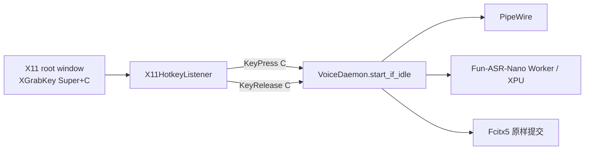

# X11 全局热键替换设计

## 目标

在 Deepin DDE 的 **X11** 会话中，以 daemon 直接监听 `Super+C` 的按下与松开事件实现按住说话。彻底放弃 DDE Keybinding1 和一次性 bridge 命令；保留既有本地音频、Fun-ASR-Nano XPU 推理、焦点校验和 Fcitx 原样上屏链路。

## 背景与根因

真实会话验证表明：DDE 已正确注册 `Super+C` 并启动 bridge，但 bridge 每次读取到的 C 键状态均为松开，只向空闲 daemon 发送 `stop`。DDE action 不能可靠提供按下/松开的生命周期事件，因此无法满足按住说话的时序约束。不能将行为暗改为切换式录音。

## 决策与约束

- 仅支持 X11；Wayland 仍不支持。
- `Super+C` 由本助手独占。其他程序不得收到这个组合键。
- 无法抓取时（例如被其他 X11 客户端占用）daemon 必须失败并输出可操作错误；不得退回 DDE、轮询、切换录音或 `/dev/input`。
- 热键事件、诊断和日志不得包含转写文本、音频、按键时间或焦点 token。
- X11 热键只驱动已有 `VoiceDaemon.start_if_idle()` / `VoiceDaemon.stop()`；不改变音频、推理、输出和焦点安全边界。

## 架构



### `X11HotkeyListener`

新增一个可替换的监听器适配器，独立持有 X11 Display，以避免和焦点查询、XTEST 注入共享跨线程 Display。

1. 在 root window 上用 `XGrabKey` 注册 C 键对应的 `Super` 修饰键组合，并同时注册 Caps Lock、Num Lock、Scroll Lock 的忽略修饰组合。
2. 任一注册失败时撤销本次已成功的 grabs、关闭 Display，并抛出 `X11HotkeyUnavailable`。因此启动是原子的。
3. 监听线程只处理该 keycode：第一次匹配的 `KeyPress` 调用开始回调；键盘自动重复产生的后续 press 被忽略。
4. 已开始的一次会话在收到同一 C keycode 的 `KeyRelease` 时调用停止回调，无论此时 Super 是否已经先松开；重复 release 被忽略。
5. 关闭时停止事件循环、等待线程退出、解除所有抓取并关闭 Display。所有清理必须幂等。

监听器可使用短时 `select()` 等待 Display 文件描述符，使 `close()` 不依赖跨线程关闭 X11 连接。停止回调必须在单独 daemon 线程中执行：转写可能耗时，但不能阻塞 X11 事件循环；开始回调同步、快速地进行已有 C 键确认和录音启动。

### Daemon 生命周期

`fun-voice-daemon` 在创建 `VoiceDaemon` 后、暴露服务 socket 前创建并启动监听器。监听器注册失败时：

- 记录 `X11 hotkey unavailable: ...`；
- 关闭已创建的资源；
- 以专用非零退出码退出；
- systemd 对该退出码不重启，避免抢占冲突导致的重启风暴。

注册成功后，daemon 的诊断 IPC 只提供：

```json
{"status":"ok","hotkey_registered":true,"hotkey_press_seen":false}
```

`hotkey_press_seen` 在第一次真实的匹配 KeyPress 时置为 `true`，随 daemon 重启清除；不记录事件时间或其他用户数据。已有 bridge 的 `held_trigger_seen` 和 C 松开轮询线程删除。

### 安装、升级与卸载

- 移除 DDE 注册/注销脚本、`fun-voice-bridge` 控制台入口和 `src/fun_voice/bridge.py`。
- 将 `start-session-bridge.sh` 与其桌面自启动条目改为仅导入图形会话环境的 `import-session-environment.sh`；它不触发热键事件。
- 安装升级阶段只要检测到旧 `dde-shortcut-id`，就读取其 DDE shortcut 记录并仅在确认为 Fun Voice Ryan 的旧 bridge 后调用 `DeleteCustomShortcut`，随后删除 id 文件与旧 `~/.local/bin/fun-voice-bridge`。无法安全确认归属时拒绝继续，并提示用户手工删除，绝不删除其他程序快捷键。
- 新安装、卸载和文档不再依赖 DDE 服务或保留 DDE 配置。

## 自检与验收

自检移除 `dde_service`、`super_c_conflict` 和 `bridge_hold_timing`，新增：

- `x11_hotkey`：通过 daemon 诊断检查已注册且已经观察到本次启动后的一次真实按下；daemon 不可达或未收到事件均为 fail。

人工验收替换为 X11 版本：在目标应用中按住 `Super+C` 开始录音、说话、松开 C 后识别；验证按住期间无重复 session、先松 Super 再松 C 仍停止、按下组合不把字母 C 输入目标应用、焦点变化不注入新窗口。另验证 daemon 因已有 X11 grab 启动失败时没有录音或降级。

## 测试策略

- 单元测试 fake X11 Display：动态 Super 修饰键解析、Lock 修饰组合、原子注册回滚、press/release 去重、先松 Super、关闭资源释放和异常路径。
- daemon 集成测试：KeyPress 启动、KeyRelease 异步停止、停止中的新 press 被状态机拒绝、诊断布尔值的隐私边界。
- 自检测试：诊断成功、未观察按下、socket 不可达三种结果；不再 mock DDE。
- 安装脚本静态/行为测试：不再安装或注册 bridge/DDE，旧 id 仅经验证后清理。
- 真实 Deepin X11 验收：检查 daemon 日志只包含状态，不含音频/转写；完成新的按住/松开手工清单。

## 不在范围内

- Wayland 全局热键。
- `/dev/input`、evdev、root 权限或键盘监听守护程序。
- DDE、切换式录音、其他热键和快捷键可配置界面。
- 修改 ASR、VAD、XPU、Fcitx 或剪贴板实现。
